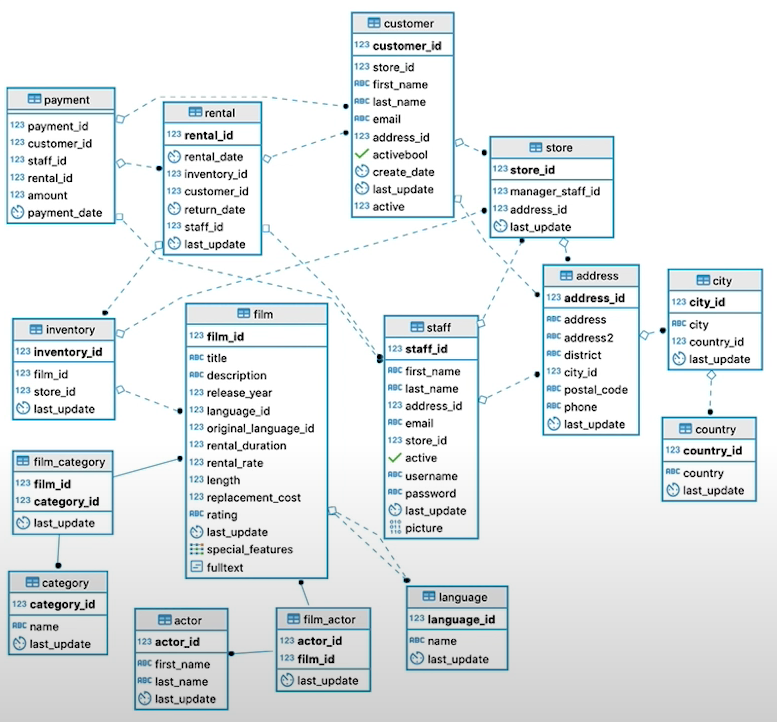
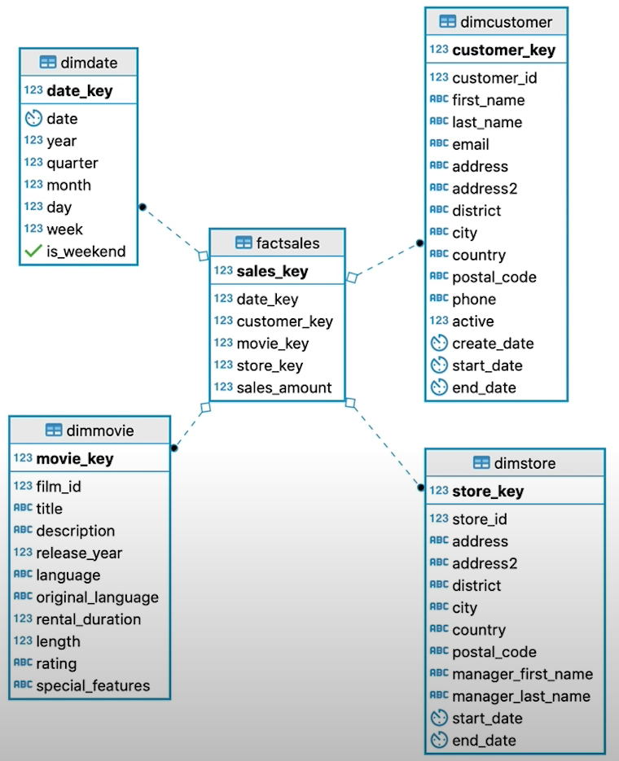

# Data Warehouse

A copy of transaction data specifically structured for query and analysis.

### Goals

- Simple to understand
- Performant
- Handles new questions
- Quality assured
- Secure

### DWH Info, Schemas and OLAP Cubes

 
Operational vs Analytical Processes

**Operational:**

- Make it work,
- For customers, staff, delivery

**Analytical:**

- Whats going on?
- For HR, marketing, management

  
Sakila DB Schemas for ETL 3NF to Star Schema

  
OLAP Cubes Operations & Approaches

Common operations to perform: slice, dice, rollup and drill down query optimization.

- **Roll-up:** Sum up some data
- **Drill-Down:** Decompose data into smaller sets
- **Slice:** Reducing N dimensions to N-1 by restricting one dimension
- **Dice:** Same dimensions but computing a sub-cube by restricting some values
  Two approaches to OLAP Cubes Technology
  #1. **MOLAP** Pre-aggregate the OLAP cubes and save them on a special purpose non-relational database.
  #2. **ROLAP** Compute OLAP cubes on the fly from existing relational databases where the dimensional model is.

### Local Data Warehouse Operations in Action!

Technologies: Python in scripts and Jyputer notebooks, PostgreSQL Database

- [Explore the Sakila Schema - 3NF (.ipynb file)](./1.0-3NF_SchemaExploration.ipynb)
- [Creating the Fact and Dimension Tables (.ipynb file)](./1.1-3NF_CreatingFactDimensionTables.ipynb)
- [ETL Process: 3NF to Fact and Dimension tables (.ipynb file)](./1.2-ETL3NFToFactDimensionTables.ipynb)
- [Query from Fact Table JOINed to the Dimension Tables (.ipynb file)](./1.3-ComputFromFactDimensionTables.ipynb)
- [OLAP Processes: Slicing, Dicing, Roll-Up, Drill-Down & Group By (.ipynb file)](./1.4-OLAP_SlicingDicingRollupDrillDownGroupBy.ipynb)
- [ OLAP Processes: Grouping Sets & Grouping By Cube (.ipynb file)](./1.5-OLAP_GroupingSets-GroupByCube.ipynb)
- [OLAP Process: Column Fromat vs Row Format in ROLAP (.ipynb file)](./1.6-OLAP_ColumnFormatInROLAP.ipynb)

### AWS Redshift Data Warehouse Operations in Action!

- [Infrastructure as Code: Creating a Redshift Cluster (.ipynb file)](./2.0-IaC_Redshift.ipynb)
- [Infrastructure as Code: Create a Redshift Cluster and load SQL (.ipynb file)](./2.1-IaC_Implementation.ipynb)
- [Infrastructure as Code: Running Parallel ETL (.ipynb file)](./2.2-IaC_ParallelETL.ipynb)
- [Infrastructure as Code: Optimizing Tables in Redshift (.ipynb file)](./2.3-IaC_OptimizeRedshiftTables.ipynb)
- **Project:** Create an ETL process that reads JSON data from S3 buckets. Transform and save the relevant data into tables in Redshift. Then perform SQL queries to anlayze it.
  - [Detailed Project information](./ProjectFolder)
  - Create a running Redshift cluster by going through the steps in this [notebook](./2.0-IaC_Redshift.ipynb)
    - Make note of the DWH_ENDPOINT :: and the DWH_ROLE_ARN ::
  - Python scripts to run in the folder:
    - Run first to create the tables.
      $ python create_tables.py
    - Run second, it will process the JSON files and insert into the DB.
      $ python elt.py
